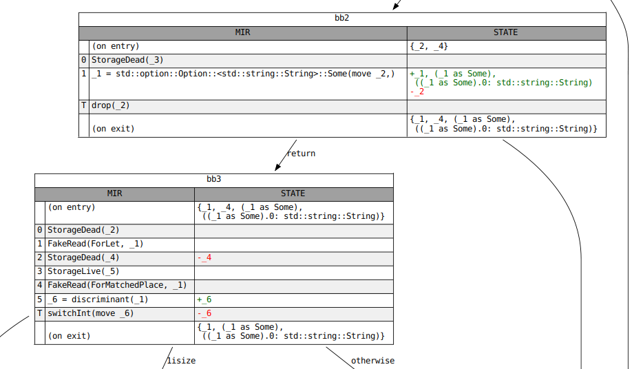

# 数据流分析

<!-- toc -->

如果您在MIR上进行开发，将会频繁遇到各种[数据流分析][wiki]。
`rustc`通过数据流发现未初始化变量，确定生成器`yield`中的存活变量，以及在控制流图指定位置计算借用`Place`。
数据流分析在现代编译器中是一个基础概念，该主题的知识对潜在贡献者十分有帮助。

注意，本文档不是对数据流分析的一般介绍。只用于对`rustc`中分析框架的描述。
它假设读者熟悉一些核心思想和基本概念，比如转换函数(transfer function)，不动点(fixpoint)和格(lattice)。
如果您不熟悉这些术语，或者想要快速复习，那么Anders Møller和Michael I. Schwartzbach撰写的[*静态程序分析*][*Static Program Analysis*]是一本很好的免费教材。
对于您喜欢视听学习，法兰克福歌德大学已经在[YouTube][goethe]上用英语发布了一系列简短的讲座，非常容易上手。 

## 定义一个数据流分析

数据流分析的接口被分解成三个trait。首先是[`AnalysisDomain`]，所有分析都必须实现它。
除了定义数据流状态类型，该trait还定义了每个基本块入口处状态的初始值，以及向前分析或者向后分析的方向。
数据流分析的域(domain)必须是一个有正确`join`操作符的[格][lattice] (严格来讲是连接语义)。
更多内容可以参考[`lattice`]和[`JoinSemiLattice`]的文档。

您必须提供一个[`Analysis`]的直接实现或者是一个[`GenKillAnalysis`]代理的实现。后者用于所谓的["gen-kill" problems]，该问题可以通过一类简单的转换函数解决。
如果一个分析的域不是`BitSet`(位图)，或者转换函数无法使用“gen”、“kill”操作实现，那么必须直接实现`Analysis`，这样的实现可能会变慢。
而所有的`GenKillAnalysis`将会通过默认的`impl`自动实现`Analysis`。


```text
 AnalysisDomain
       ^
       |          | = has as a supertrait
       |          . = provides a default impl for
       |
   Analysis
     ^   ^
     |   .
     |   .
     |   .
 GenKillAnalysis

```

### 转换函数与作用函数

`rustc`的数据流分析框架允许基本块内的每条语句(包括终结语句terminator)定义自己的转换函数。
简便起见，这些独立的转换函数在下面被成为“作用函数”。
每个作用函数都以数据流顺序依次执行，并且它们共同定义了整个基本块的传递函数。
也可以为终结语句(terminator)的特定的传出边(译注：分支跳转的特定边)定义一个“作用函数”(例如[`apply_call_return_effect`]作用于`Call`指令的后继边)，
这些被称为“单边作用”(per-edge effects)。

`GenKillAnalysis`的方法与`Analysis`的方法之间唯一有意义的区别（除“apply”前缀之外）是`Analysis`对数据流状态可以直接修改，
而`GenKillAnalysis`仅能看到`GenKill` trait的实现者，即只允许`gen`和`kill`操作可变。 

### “前序”作用

细心的读者可能会注意到，每个语句实际上都有两种可能的作用函数，即“前序”作用("before" effects)和“非前序”作用(主要作用，effects)。
**无论分析的方向如何**，“前序”作用都会在主要作用函数之前应用。
换句话说，后向分析将在计算基本块的传递函数时先应用“前序”作用函数，然后调用“主要”作用函数，就像正向分析一样。 

大多数分析仅使用“主要”作用，如果每条语句具有多个作用函数，会使得调用者难以抉择。
但是，“前序”作用在某些情况下很有用，例如当必须将赋值语句左右表达式分开考虑时。 

### 终止条件

您的分析必须能收敛到不动点，否则会一直执行下去。
不动点的收敛是一种“达到平衡”的方式。为了达到平衡，您的分析必须满足某些定律。其中之一的定律是任意值与底值(bottom)结合等于该值，即满足如下等式：

> *bottom* join *x* = *x*

另一条定律是您的分析需要有一个满足如下等式的顶值(top)：

> *top* join *x* = *top*

顶值可以确保半格的高度是有限的，并且上述的定律保证了一旦数据流状态到达顶值，将不在发生变化。

## 例子

本节提供了一个简单的数据流分析。它没有解释您需要了解的所有内容，但希望它将使本页面的其余部分更加清晰。

假设我们要做一个简单的分析，以确定程序中的某个点是否已经调用过`mem::transmute`。
我们的分析域将是一个布尔变量，它表示到目前为止是否已调用了`transmute`。
底值是`false`，因为初始情况下未调用`transmute`。
顶值是`true`，因为一旦我们确定调用了`transmute`，分析就完成了。
我们的join运算符是OR（||）运算符。使用OR而不是AND是由于存在以下场景： 

```
let x = if some_cond {
    std::mem::transmute<i32, u32>(0_i32); // transmute 被调用!
} else {
    1_u32; // transmute 未被调用
};

// 此处 transmute 被调用了吗? 保守结果认为是true
println!("x: {}", x);
```

## 检查结果

如果您实现了一个分析，您必须将它传给引擎[`Engine`]。
这个功能通过定义`Analysis`中的[`into_engine`]函数，比`Engine::new_gen_kill`来构造效率更高。

调用`Engin`中的`iterate_to_fixpoint`可以返回`Results`，该结构中包含每个基本块进入时不动点的数据流状态。
当拥有一个`Results`结构，您可以在CFG的任意位置检查不动点的数据流状态。如果只需要少量位置的状态，可以使用[`ResultsCursor`]。
如果需要**每个**位置的状态，使用[`ResultsVisitor`]更加高效。

```text
                         Analysis
                            |
                            | into_engine(…)
                            |
                          Engine
                            |
                            | iterate_to_fixpoint()
                            |
                         Results
                         /     \
 into_results_cursor(…) /       \  visit_with(…)
                       /         \
               ResultsCursor  ResultsVisitor
```

下方是[`ResultsVisitor`]的示例代码：


```rust,ignore
// Assuming `MyVisitor` implements `ResultsVisitor<FlowState = MyAnalysis::Domain>`...
let mut my_visitor = MyVisitor::new();

// inspect the fixpoint state for every location within every block in RPO.
let results = MyAnalysis::new()
    .into_engine(tcx, body, def_id)
    .iterate_to_fixpoint()
    .visit_in_rpo_with(body, &mut my_visitor);
```

[`ResultsCursor`]示例代码：

```rust,ignore
let mut results = MyAnalysis::new()
    .into_engine(tcx, body, def_id)
    .iterate_to_fixpoint()
    .into_results_cursor(body);

// Inspect the fixpoint state immediately before each `Drop` terminator.
for (bb, block) in body.basic_blocks().iter_enumerated() {
    if let TerminatorKind::Drop { .. } = block.terminator().kind {
        results.seek_before_primary_effect(body.terminator_loc(bb));
        let state = results.get();
        println!("state before drop: {:#?}", state);
    }
}
```

### Graphviz图

当需要调试数据流分析结果的时候，可以使用可视化工具。通过[MIR调试命令][Debugging MIR]中的`-Z dump-mir`来完成。
以`-Z dump-mir=F -Z dump-mir-dataflow`开头，其中`F`是"all"或是您感兴趣的MIR函数的名称。

这些`.dot`文件将保存在您的`mir_dump`目录中，并将分析的[`NAME`] (例如，`maybe_inits`)作为其文件名的一部分。
每个可视化文件将在每个基本块的入口和出口显示完整的数据流状态，以及每个语句和终止语句中发生的任何更改。请参见下面的示例： 



["gen-kill" problems]: https://en.wikipedia.org/wiki/Data-flow_analysis#Bit_vector_problems
[*Static Program Analysis*]: https://cs.au.dk/~amoeller/spa/
[Debugging MIR]: ./debugging.html
[`AnalysisDomain`]: https://doc.rust-lang.org/nightly/nightly-rustc/rustc_mir/dataflow/trait.AnalysisDomain.html
[`Analysis`]: https://doc.rust-lang.org/nightly/nightly-rustc/rustc_mir/dataflow/trait.Analysis.html
[`Engine`]: https://doc.rust-lang.org/nightly/nightly-rustc/rustc_mir/dataflow/struct.Engine.html
[`GenKillAnalysis`]: https://doc.rust-lang.org/nightly/nightly-rustc/rustc_mir/dataflow/trait.GenKillAnalysis.html
[`JoinSemiLattice`]: https://doc.rust-lang.org/nightly/nightly-rustc/rustc_mir/dataflow/lattice/trait.JoinSemiLattice.html
[`NAME`]: https://doc.rust-lang.org/nightly/nightly-rustc/rustc_mir/dataflow/trait.AnalysisDomain.html#associatedconstant.NAME
[`ResultsCursor`]: https://doc.rust-lang.org/nightly/nightly-rustc/rustc_mir/dataflow/struct.ResultsCursor.html
[`ResultsVisitor`]: https://doc.rust-lang.org/nightly/nightly-rustc/rustc_mir/dataflow/trait.ResultsVisitor.html
[`apply_call_return_effect`]: https://doc.rust-lang.org/nightly/nightly-rustc/rustc_mir/dataflow/trait.Analysis.html#tymethod.apply_call_return_effect
[`into_engine`]: https://doc.rust-lang.org/nightly/nightly-rustc/rustc_mir/dataflow/trait.Analysis.html#method.into_engine
[`lattice`]: https://doc.rust-lang.org/nightly/nightly-rustc/rustc_mir/dataflow/lattice/index.html
[goethe]: https://www.youtube.com/watch?v=NVBQSR_HdL0&list=PL_sGR8T76Y58l3Gck3ZwIIHLWEmXrOLV_&index=2
[lattice]: https://en.wikipedia.org/wiki/Lattice_(order)
[wiki]: https://en.wikipedia.org/wiki/Data-flow_analysis#Basic_principles
